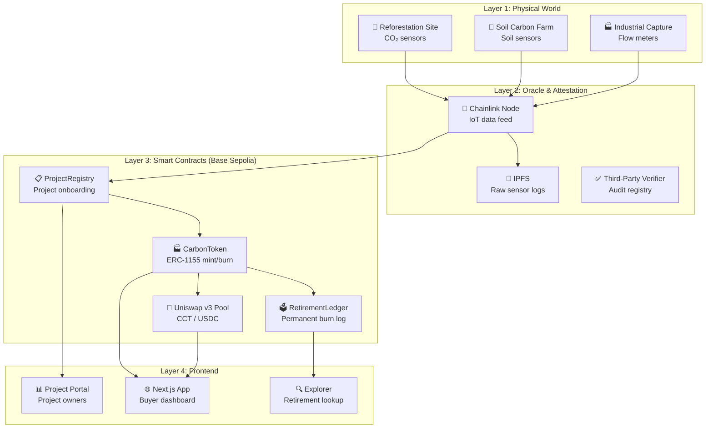
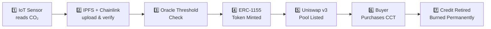

# 📊 Carbon Credit Tokenization Protocol — Detailed Analysis Report

> **Source:** [CarbonCredit_Protocol_Brief.pdf](file:///c:/Users/blazi/Downloads/Carbon-Web3/CarbonCredit_Protocol_Brief.pdf)
> **Pages:** 25 | **Characters:** ~34,000 | **Analysis Date:** June 10, 2026

---

## 1. Document Overview

This is a **Blockchain & Web3 Track Hackathon Project Brief** for a **Carbon Credit Tokenization Protocol** — a system that bridges physical-world carbon sequestration with on-chain financial markets. The document is a comprehensive, self-contained build guide spanning 13 sections, designed for a **36-hour hackathon** with a team of 2–3 developers.

| Attribute | Value |
|---|---|
| **Project Type** | Hackathon Build (Blockchain & Web3 Track) |
| **Complexity** | High |
| **Impact** | Very High |
| **Novelty** | High |
| **Smart Contracts** | 5 |
| **External Oracles** | 3 |
| **Build Timeline** | ~36 hours |
| **Target Market** | $420B (projected by 2030) |

### Core Tech Stack
`Solidity` · `ERC-1155` · `Chainlink` · `IPFS` · `Uniswap v3` · `Next.js 14` · `wagmi v2` · `Foundry` · `The Graph` · `Base Sepolia`

---

## 2. Problem Space Analysis

The protocol targets the **Voluntary Carbon Market (VCM)** — a market projected to reach **$420B by 2030** but riddled with systemic failures:

| Problem | Current Reality | Protocol Solution |
|---|---|---|
| **Double Counting** | Same offset sold across multiple registries; no shared ledger | On-chain uniqueness via ERC-1155 token IDs; burns are final |
| **Stale Audits** | One-time audits from years ago represent "current" state | Real-time IoT attestation via Chainlink oracles |
| **Opaque Retirement** | Retirement certificates are unverifiable PDFs from private registries | ERC-1155 `burn()` emits permanent on-chain `RetirementEvent` |
| **High Intermediary Costs** | Brokers extract 40–60% margin | Uniswap v3 pool with 0.3% fee; project receives 99.7% |
| **No Price Discovery** | OTC negotiations in spreadsheets | AMM provides continuous public price discovery (TWAP queryable) |

### Key Statistics Cited
- **$2** — Average legacy price per tonne
- **89%** — Offsets never independently verified
- **3×** — Double-counting rate in voluntary market

> [!IMPORTANT]
> The one-line pitch: *"We replace a $420B market built on PDF certificates and broker phone calls with IoT sensor data, ZK-attested proofs, and a burn function."*

---

## 3. Solution Architecture (4-Layer Design)

The protocol uses a **4-layer architecture** flowing from physical sensors to user-facing applications:



### Component Dependency Map

| Component | Depends On | Exposes To | Critical Path? |
|---|---|---|---|
| IoT Sensors | Physical hardware | Chainlink node | ✅ Yes |
| Chainlink Oracle | IoT data feed, IPFS | CarbonToken contract | ✅ Yes |
| ProjectRegistry | Deployer wallet | CarbonToken, frontend | ✅ Yes |
| CarbonToken (ERC-1155) | ProjectRegistry, Chainlink | Uniswap pool, RetirementLedger | ✅ Yes |
| RetirementLedger | CarbonToken | Frontend, explorer | ❌ Demo stub OK |
| Uniswap v3 Pool | CarbonToken, USDC | Frontend swap UI | ⚠️ Partial (mock OK) |
| IPFS (Pinata) | Pinata API | CarbonToken metadata URI | ⚠️ Partial |
| Next.js Frontend | wagmi, viem, The Graph | End users | ✅ Yes |

### MVP Scope (36-hour build)
> ProjectRegistry + CarbonToken + mock Chainlink feed + RetirementLedger + basic Next.js UI.
> Skip Uniswap integration — show price as a static display.
> The core value proposition (**mint → trade → burn**) must work end-to-end.

---

## 4. Smart Contract Design (5 Contracts)

### Contract Overview

| Contract | Standard | Key Functions | Deployer |
|---|---|---|---|
| `ProjectRegistry.sol` | Ownable | `registerProject`, `approveProject`, `getProject` | Protocol admin |
| `CarbonToken.sol` | ERC-1155 | `mintBatch`, `retire`, `uri`, `totalSupply` | ProjectRegistry |
| `OracleConsumer.sol` | Chainlink Client | `requestSequestration`, `fulfill`, `getLatestReading` | CarbonToken |
| `RetirementLedger.sol` | Custom | `recordRetirement`, `getByAddress`, `getByProject` | CarbonToken |
| `CarbonPoolFactory.sol` | Uniswap v3 fork | `createPool`, `addLiquidity`, `swap` | Protocol admin |

### CarbonToken.sol — Core Data Structure

```solidity
struct CreditMetadata {
    uint256 projectId;
    uint256 vintage;          // Year of sequestration
    uint256 tonnesCO2;        // Verified CO2 in kg (×1000)
    bytes32 iotDataHash;      // IPFS hash of raw sensor data
    uint256 oracleTimestamp;  // When oracle confirmed reading
    bool retired;
}
```

### Token Lifecycle State Machine

```
IoT Data Received → Oracle Verified → MINTED (ERC-1155 exists)
                                          ↓
                    LISTED (Uniswap pool) → TRANSFERRED (buyer holds) → RETIRED (burned permanently)
```

> [!CAUTION]
> **ERC-1155 tokenId Collision Gotcha**: Using `keccak256(projectId, vintage)` causes collisions when two projects share the same vintage year. The document recommends `keccak256(abi.encodePacked(projectId, vintage, block.timestamp))` or an auto-incrementing counter.

### Oracle Data Integrity Checks (6 Layers)

| Check | Method | Failure Action |
|---|---|---|
| Device signature valid | ECDSA recover against registered device pubkey | Revert, emit `SuspiciousData` |
| Timestamp freshness | `block.timestamp - reading.ts < 7 days` | Revert with `StaleData` |
| Minimum threshold | `tonnesCO2 ≥ MIN_TONNES` (default 1000 kg) | Queue for next cycle |
| Project is active | `ProjectRegistry.getProject(projectId).active == true` | Revert with `InactiveProject` |
| No duplicate minting | `credits[tokenId].oracleTimestamp == 0` | Revert with `AlreadyMinted` |
| Multi-oracle consensus | ≥ 3 of 5 oracle nodes agree within 5% | Request new reading after 1hr |

---

## 5. Data Flow — End-to-End Transaction Pipeline

The document details a **7-step pipeline** from physical CO₂ measurement to permanent retirement:



### Step Details

1. **IoT Sensor** — ESP32/industrial sensor reads every 6 hours, data signed with device private key
2. **IPFS + Chainlink** — JSON uploaded to Pinata, CID sent to Chainlink Any API job
3. **Oracle Threshold** — Verifies ≥1 tonne CO₂, device registration, data freshness
4. **ERC-1155 Mint** — `tokenId = keccak256(projectId, vintage)`, metadata stored on-chain + IPFS
5. **Uniswap Listing** — CCT/USDC pool created, price discovery begins
6. **Purchase** — Corporate buyer swaps USDC → CCT via frontend (wagmi + Base, ~2s confirmation)
7. **Retirement** — `burn()` + `RetirementLedger.recordRetirement()` — permanent and publicly verifiable

### Mock Sensor Data Format
```json
{
  "projectId": 1,
  "co2_kg": 4200,
  "lat": -3.4,
  "lng": 37.2,
  "altitude": 1200,
  "temperature": 22.5,
  "humidity": 68,
  "timestamp": 1719000000,
  "deviceId": "sensor-001",
  "signature": "0x..."
}
```

---

## 6. Tech Stack Breakdown

### Smart Contract Layer

| Tool | Version | Purpose |
|---|---|---|
| Solidity | ^0.8.20 | Smart contract language |
| Foundry | latest | Testing + deployment |
| Hardhat | 2.22 | Local devnet + scripts |
| OpenZeppelin | 5.x | ERC-1155, Ownable, etc. |
| Chainlink Contracts | 0.8.0 | Oracle consumer base |
| Uniswap v3-core | 1.0.1 | Pool creation |
| Uniswap v3-periphery | 1.4.4 | Swap router |

### Frontend Layer

| Tool | Version | Purpose |
|---|---|---|
| Next.js | 14.x | React framework |
| wagmi | 2.x | Web3 React hooks |
| viem | 2.x | Ethereum interactions |
| @tanstack/query | 5.x | Data fetching |
| TailwindCSS | 3.x | Styling |
| Recharts | 2.x | Charts (price, sequestration) |
| Framer Motion | 11.x | Animations |

### Infrastructure & Services

| Service | Purpose | Free Tier? |
|---|---|---|
| Base Sepolia | Testnet deployment | ✅ |
| Chainlink Any API | IoT oracle | ✅ (testnet) |
| Pinata | IPFS pinning | ✅ (1GB) |
| The Graph | Event indexing | ✅ |
| Alchemy | RPC provider | ✅ (300M/mo) |
| Vercel | Frontend hosting | ✅ |

### Build Time Estimates

| Component | Complexity | Estimated Time |
|---|---|---|
| Solidity Contracts | HIGH | ~8h |
| Chainlink Oracle | HIGH | ~5h |
| Next.js Frontend | MEDIUM | ~7h |
| The Graph Subgraph | MEDIUM | ~3h |
| IPFS / Pinata | LOW | ~2h |
| Uniswap v3 Pool | HIGH | ~4h |
| Deployment + Verify | LOW | ~2h |
| **Total** | | **~31h** |

---

## 7. Frontend Architecture

### Application Routes (8 Pages)

| Route | Page | Key Components | Data Source |
|---|---|---|---|
| `/` | Landing / Dashboard | Stats banner, recent retirements, live price | The Graph, Uniswap SDK |
| `/projects` | Project Marketplace | Project cards, filter by type/region/vintage | ProjectRegistry contract |
| `/projects/[id]` | Project Detail | IoT chart, sensor map, buy button, audit docs | Contract + IPFS |
| `/buy` | Purchase Flow | Uniswap widget, token selector, amount input | Uniswap v3 SDK |
| `/retire` | Retirement Flow | Holdings list, retire form, certificate gen | CarbonToken contract |
| `/certificate/[id]` | Retirement Certificate | PDF-style cert, on-chain verification badge | RetirementLedger |
| `/dashboard` | Portfolio | Holdings, history, offset progress bar | wagmi + The Graph |
| `/onboard` | Project Onboarding | Registry form, sensor config, IPFS upload | ProjectRegistry + Pinata |

### Core Web3 Hook Pattern (wagmi v2)
The document provides production-ready hook code using `useReadContract`, `useWriteContract`, and `useWaitForTransactionReceipt` — the correct wagmi v2 API surface (not the deprecated `useContractWrite` from v1).

> [!TIP]
> **"Wow Moment" Component**: The IoT Sequestration Chart (Recharts `AreaChart` with gradient fill, animated on mount) is explicitly called out as the single most impressive UI element — *"Build this first, it's your wow moment."*

---

## 8. AI Agent Build Prompts (8 Prompts)

The document includes **8 self-contained, copy-paste prompts** designed for Claude, Cursor, and GitHub Copilot. They are ordered by build sequence:

| # | Prompt | Target Tool | Purpose |
|---|---|---|---|
| 01 | Project Setup | Claude Code / Cursor | Scaffold full project structure |
| 02 | Core Contracts | Claude Code / Cursor | Write all 4 core Solidity contracts |
| 03 | Foundry Tests | Claude Code / Cursor | 8 test scenarios + MockOracle |
| 04 | Frontend Dashboard | Claude / Cursor | Project detail page with IoT chart |
| 05 | Oracle Simulator | Claude Code | Node.js IoT simulation script |
| 06 | The Graph Subgraph | Claude Code | Event indexing (schema, mappings, queries) |
| 07 | Retirement Certificate | Claude / v0.dev | Premium certificate component |
| 08 | Deployment Script | Claude Code | Full Foundry deploy to Base Sepolia |

> [!NOTE]
> These prompts are notably well-engineered — each specifies exact function signatures, data structures, library versions, file paths, and expected outputs. They are designed to minimize AI hallucination and maximize first-attempt correctness.

---

## 9. Vibe Coder Tips (10 Shortcuts)

Key practical advice for speed-running the build:

1. **Mock Oracle First** — Build everything against `MockOracle.sol`; wire real Chainlink at hour 30
2. **Foundry Anvil Fork** — `anvil --fork-url` gives local Base Sepolia fork with 10,000 ETH test accounts
3. **Scaffold-ETH 2** — Use `npx create-eth@latest` instead of scaffolding from scratch
4. **Pre-pin IPFS Data** — Create mock IoT JSON before hackathon; hard-code CID everywhere
5. **Certificate = Demo** — Spend 2 hours making it beautiful; it's the most photogenic moment
6. **tokenId Collision Fix** — Use auto-incrementing counter, not raw `keccak256(projectId, vintage)`
7. **wagmi v2 API** — `useWriteContract` (not `useContractWrite`); avoid pre-2024 Stack Overflow
8. **Skip Uniswap Pool** — Hardcode price ($18.50/tonne); use 4 saved hours on oracle/certificate
9. **Deploy to Base Sepolia** — Never demo on localhost; deploy at hour 20
10. **Slither Check** — Run `slither contracts/ --print human-summary` in the last hour

---

## 10. Build Timeline (36-Hour Schedule)

| Hours | Phase | Key Deliverables |
|---|---|---|
| H 0–2 | Setup & Foundation | Scaffold, .env, MockOracle on Anvil, demo IPFS dataset |
| H 2–8 | Core Contracts | ProjectRegistry + CarbonToken + RetirementLedger + tests (80%+ coverage) |
| H 8–12 | Oracle Integration | OracleConsumer + MockOracle wiring + oracle simulator script |
| H 12–20 | Frontend Sprint | 4 core pages + wagmi hooks + retirement certificate |
| H 20–24 | Testnet Deploy | Contracts on Base Sepolia + Basescan verify + full E2E flow |
| H 24–28 | The Graph + Chainlink | Subgraph deployment + real Chainlink (if time permits) |
| H 28–33 | Polish & Buffer | UI polish, loading states, error handling, Slither, mobile responsive |
| H 33–36 | Demo Prep | Practice 3×, fund wallets, seed 3 demo projects, architecture slide |

---

## 11. Risk Matrix

| Risk | Likelihood | Severity | Mitigation |
|---|---|---|---|
| Chainlink oracle not working on testnet | 🔴 High | 🔴 High | Build MockOracle first; wire real Chainlink only after everything works |
| Uniswap v3 pool setup fails | 🔴 High | 🟡 Medium | Skip entirely; display hardcoded price |
| IPFS uploads too slow during demo | 🟡 Medium | 🟡 Medium | Pre-upload all demo data; hard-code CIDs |
| wagmi v2 API confusion | 🔴 High | 🟢 Low | Use official v2 docs; avoid Stack Overflow |
| ERC-1155 tokenId collision | 🟡 Medium | 🔴 High | Auto-incrementing counter; test with identical project+vintage |
| Testnet ETH/LINK insufficient | 🟢 Low | 🟡 Medium | Request from faucets 24h early; keep 5 funded wallets |
| Demo wallet has no credits to retire | 🟡 Medium | 🔴 High | Pre-mint 100 credits to 3 demo wallets; test 5× before presenting |

---

## 12. Demo Script (3 Minutes)

| Timestamp | Section | Key Action |
|---|---|---|
| 0:00–0:30 | **The Hook** | Drop the 89% stat + $420B market + "PDF certificates and broker phone calls" |
| 0:30–1:15 | **Sequestration Chart** | Show live IoT chart, click data point → IPFS raw data |
| 1:15–1:45 | **Buy a Credit** | Connect MetaMask → buy 5 tonnes → show ERC-1155 in wallet |
| 1:45–2:30 | **Retire the Credit** | Select credits → enter reason → burn → certificate appears |
| 2:30–3:00 | **The Close** | Show certificate, Basescan link, IPFS hash, "No broker. No PDF. No double-counting. Ever." |

### Prepared Judge Q&A

| Question | Prepared Answer |
|---|---|
| *How do you prevent spoofed IoT data?* | Device private keys registered in ProjectRegistry; oracle verifies ECDSA signature |
| *Why Base and not Ethereum mainnet?* | Gas costs — $20 credit shouldn't cost $15 in gas; Base = $0.001 tx with ETH security |
| *What stops duplicate sensor reports?* | Oracle checks `credits[tokenId].oracleTimestamp == 0`; re-minting reverts |

---

## 13. Post-Hackathon Roadmap

| Phase | Timeline | Milestones | Key Risk |
|---|---|---|---|
| **V1 — Hackathon** | Week 0 | MockOracle, ERC-1155, Retirement, demo UI on Base Sepolia | Demo reliability |
| **V2 — Protocol** | Month 1–2 | Real Chainlink, Uniswap v3 pool, The Graph, security audit | Oracle reliability |
| **V3 — Market** | Month 3–4 | Multi-chain (Polygon, Arbitrum), institutional onboarding, corporate API | Regulatory clarity |
| **V4 — Mainnet** | Month 5–6 | Base mainnet, 3 live IoT projects, Verra/Gold Standard integration | Smart contract bugs |
| **V5 — Scale** | Month 7–12 | DAO governance, fractional credit NFTs, carbon futures, mobile app | Execution bandwidth |

---

## 14. Critical Observations & Assessment

### ✅ Strengths

1. **Exceptionally well-structured** — The document is one of the most thorough hackathon briefs I've seen. Every section builds logically on the previous one.
2. **Production-level smart contract design** — The 6-layer oracle integrity check system (device signatures, timestamp freshness, multi-oracle consensus) goes well beyond typical hackathon scope.
3. **Realistic scoping** — The document explicitly identifies what to skip (Uniswap pool, real Chainlink) and what to mock, showing strong prioritization.
4. **AI-native workflow** — The 8 agent prompts are designed for modern AI-assisted development, with exact function signatures and version-pinned libraries.
5. **Strong demo narrative** — The 3-minute demo script is crafted for maximum judge impact with specific rehearsal instructions.

### ⚠️ Potential Concerns

1. **36-hour timeline is aggressive** — The estimated component build times sum to ~31h, leaving only ~5h buffer. Realistically, this requires a highly experienced team.
2. **IoT hardware dependency** — The physical sensor layer is entirely mocked. Real IoT integration would add significant complexity in a production deployment.
3. **Chainlink Any API on testnet** — Known to be unreliable; the document correctly advises mocking first, but this is a real risk for post-hackathon development.
4. **Regulatory gap** — The roadmap mentions "regulatory clarity" as a V3 risk but provides no analysis of compliance requirements (carbon credit registries like Verra have strict rules).
5. **Security audit costs** — Listed in V2 roadmap but not budgeted. Solidity audits for DeFi protocols typically cost $50K–$200K+.

### 🎯 Feasibility Rating

| Dimension | Rating | Notes |
|---|---|---|
| **Technical Feasibility** | ⭐⭐⭐⭐☆ | All components use proven tech; the integration is the challenge |
| **Hackathon Completability** | ⭐⭐⭐☆☆ | Tight timeline; success depends on team experience and pre-work |
| **Market Viability** | ⭐⭐⭐⭐☆ | Real pain point in a massive growing market |
| **Novelty** | ⭐⭐⭐⭐☆ | IoT + Oracle + DeFi composability is differentiated |
| **Demo Impact** | ⭐⭐⭐⭐⭐ | The sequestration chart + retirement certificate flow is very compelling |

---

## 15. Recommendations

> [!TIP]
> **If building this project**, follow the document's own advice: mock first, deploy to testnet early, and make the retirement certificate beautiful. The document's prioritization guidance is sound.

1. **Start with Prompt 01 + 02** to get the project scaffold and core contracts working
2. **Build the IoT chart component early** — it's the strongest visual differentiator
3. **Pre-fund 5+ wallets** with testnet ETH/LINK before the hackathon
4. **Pin mock IPFS data immediately** — don't let upload latency derail your demo
5. **Practice the demo script 5 times** — the difference between winning and losing is demo polish, not code quality
